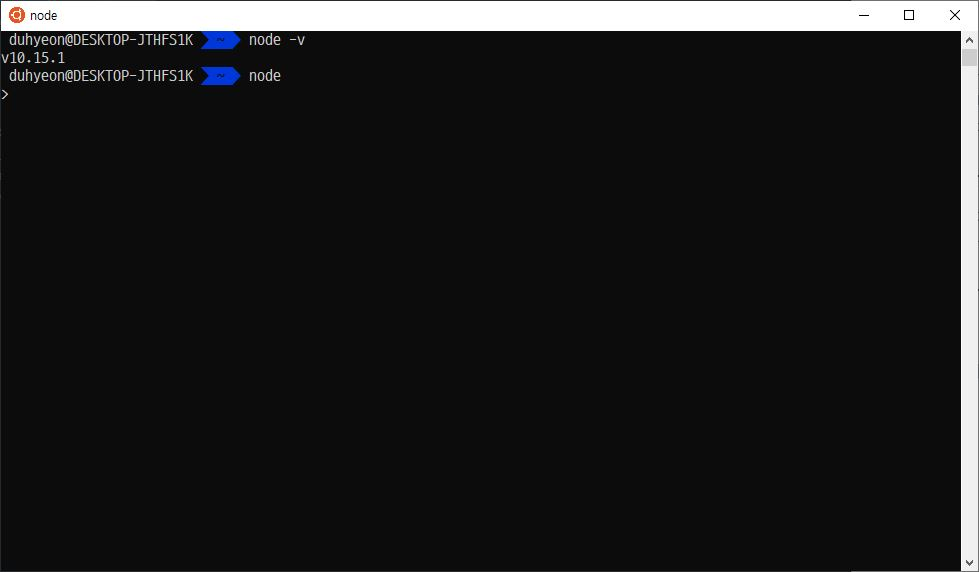

# #1 NodeJS Theory

### Node.js의 적합한 선택


> - Back-end & Front-end 모두 JS로 구현하고 싶을 때
> - 데이터 다루기 좋음 - 데이터 분석 (X) → 메세지, 알림, 실시간 처리 등 (O)
> - 실시간 처리에 대한 개발이 필요 할 때 → ex) socket.io

### Node.js란?

> `Node.js`가 나옴으로 인해서 `Browser`에만 종속되어 있던 `JavaScript`가 밖으로 나올 수 있게 되었다. ex) consol에서 또는 `Mobile APP` or `Electron App` 다양하게 쓰임

### Node.js Install

- [NodeJS 공식홈페이지로 이동](https://nodejs.org/ko/)

> 공식 홈페이지로 가서 LTS버전 다운로드



```bash
# node.js 업그레이드

npm upgrade node
```
